# Charlie Road

**Play it: [bcollier.github.io/charlie-road](https://bcollier.github.io/charlie-road/)**

Curious what 30 minutes got? **[Play v1](https://bcollier.github.io/charlie-road/v1/)**, the in-class prototype, untouched.

## What it is

Charlie is our 9 year old American Cocker Spaniel. He is a fun loving dog with a lot of attitude who lives for chasing tennis balls, wherever that may take him. In this game that means straight across eight lanes of traffic.

Charlie Road is a browser replica of *Crossy Road* with Charlie in the chicken's place. It keeps the bones of the original (the voxel look, one hop per input, endless roads, rivers and railways, a camera that scrolls forward and punishes dawdling) and swaps in the things that matter to him: tennis balls instead of coins, a bark that stops traffic, squirrels to chase, outfits from his real wardrobe as unlocks, and a squirrel-piloted flying saucer where the eagle used to be. Charlie's favorite toy right now is a giant yellow caterpillar, so catching one in the game is worth five tennis balls, and he plays with it for a moment before dropping it on the grass.

<table>
  <tr>
    <td align="center">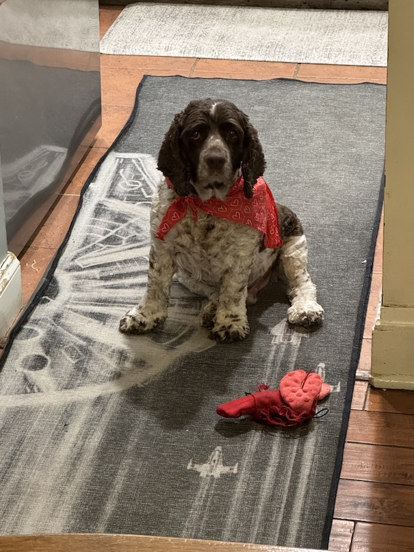<br><b>Bandana</b></td>
    <td align="center">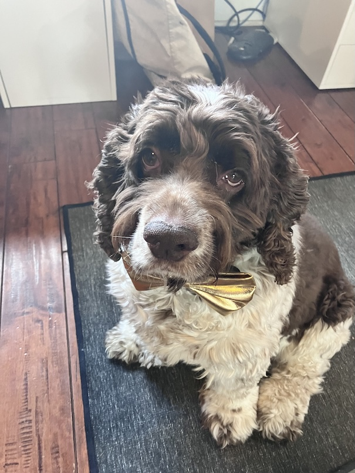<br><b>Bow tie</b></td>
    <td align="center">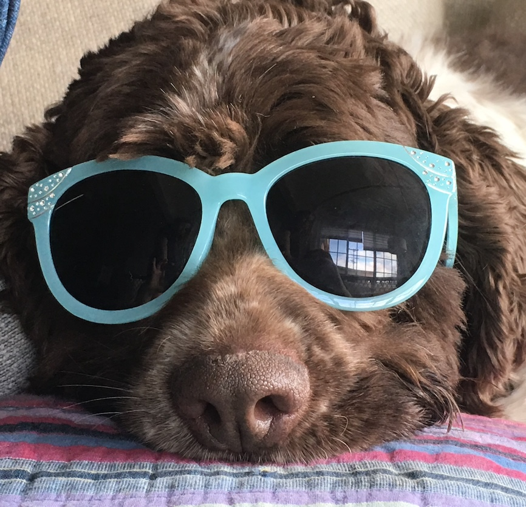<br><b>Shades</b></td>
    <td align="center">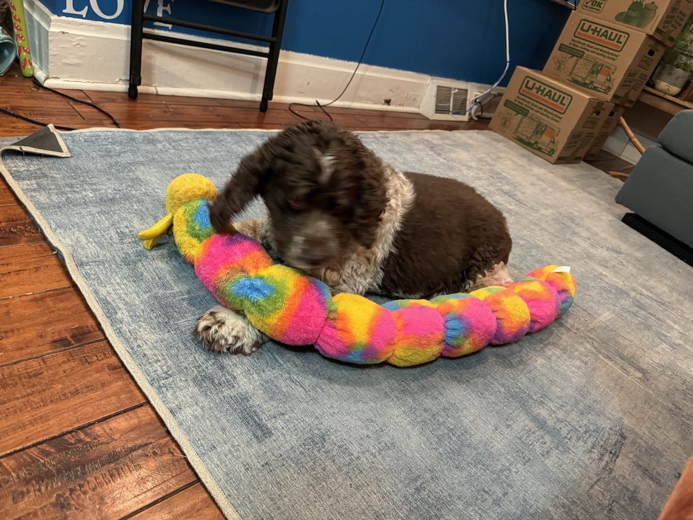<br><b>The caterpillar</b></td>
  </tr>
</table>

All four are in the game. Static site, no build step, hosted on GitHub Pages.

## How to play

| | Desktop | Mobile |
|---|---|---|
| Move one tile | Arrow keys or WASD | Tap = forward, swipe = that direction |
| Start / restart | Space or Enter, or any move | Tap |
| Bark | B, or the **🐶** button | **Shake** the phone, or the 🐶 button |
| Pause | P or Esc, or the **II** button | **II** button |
| Mute | M, or the **♪** button | **♪** button |

**Scoring.** Score is the furthest row you reach, one point per row forward, never lost by stepping back. Your best is saved in the browser and shown under the live score.

**Balls.** Tennis balls bounce on the ground; hop onto one to fetch it. They are the currency for outfits and are saved for life. Chain pickups within six seconds for a **combo** worth up to x3. Rare **golden balls** are worth 5 and tend to sit just past a hazard. Catch a **squirrel** for +3 (it panics and bolts) or Charlie's **caterpillar** for +5. Three hops in a second gives him the **zoomies**: double speed for two seconds.

**Losing.** Get hit by a car, bus, truck or train; land in the river off a log or lily pad; ride a log off the edge of the field; or stand still too long (or fall behind the camera) and the squirrels' saucer beams you up. A **bark** freezes every vehicle in your row and the two ahead for 1.5 s, with a 6 s cooldown. Trains ignore it.

**Extras.** Balls unlock the shades, bandana, bow tie and sweater; a newly earned outfit drops onto Charlie at the start of your next run and he puts it on. **DAILY CHALLENGE** on the title screen plays the same world for everyone that day with its own best. **CARD** on game over renders a shareable trading card of the run.

## How it was built, in pictures

### The first 30 minutes, in class (Kiro)

Five versions in half an hour, from coloured rectangles to a fake-isometric board that never quite worked. The prompts are in `prompt_log.md`; the code is preserved in `v1/` and you can **[play it here](https://bcollier.github.io/charlie-road/v1/)** (arrow keys or WASD, R to restart).

<table>
  <tr>
    <td align="center">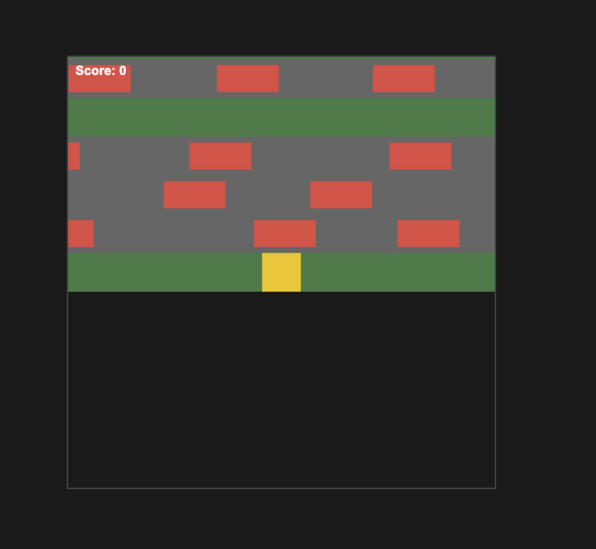<br><b>V1</b>: rectangles on a canvas. It moved and it scored.</td>
    <td align="center">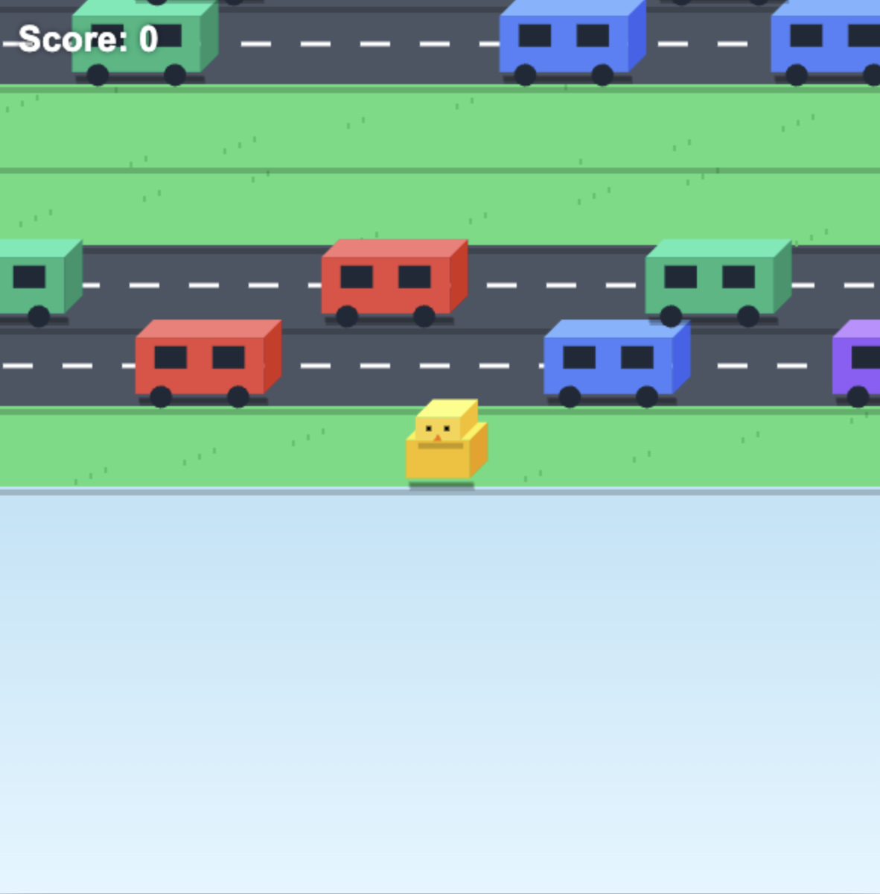<br><b>V2</b>: cars with windows, a chicken with a beak, drop shadows.</td>
    <td align="center">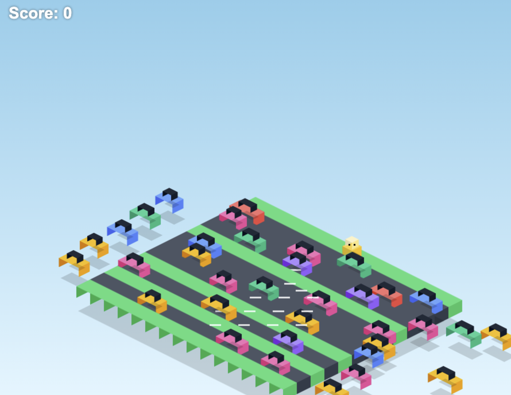<br><b>V3</b>: a bigger board and a first try at 2.5D.</td>
  </tr>
  <tr>
    <td align="center">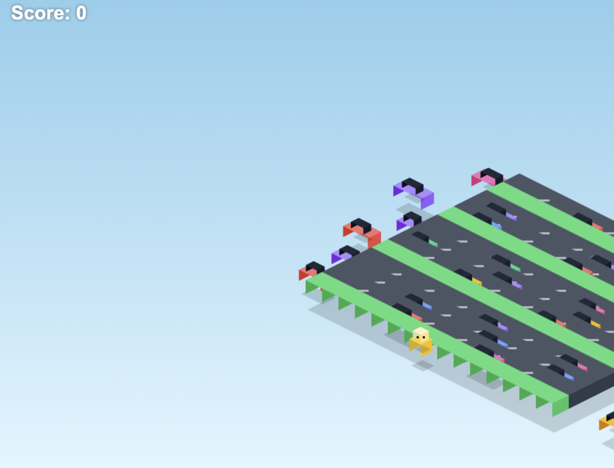<br><b>V4</b>: the player starts bottom-left, like the real game.</td>
    <td align="center">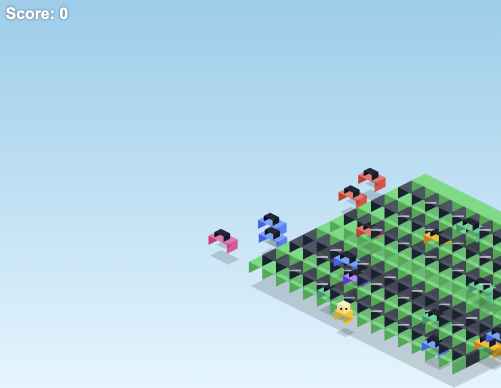<br><b>V5, end of the 30 minutes</b>: centred, slower, easier. The cars were still being chopped up by the fake depth sort.</td>
    <td></td>
  </tr>
</table>

### The rebuild, at home (Claude Code)

Planned for four hours, took about three. Camera angle measured from real gameplay screenshots, three.js instead of a fake isometric, Charlie rigged with spring-loaded ears, every block verified by stepping the simulation through a debug harness.

<table>
  <tr>
    <td align="center">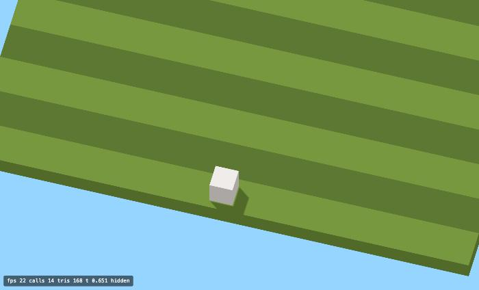<br><b>Block 0</b>: the camera rig, checked against the reference at 12.67°.</td>
    <td align="center">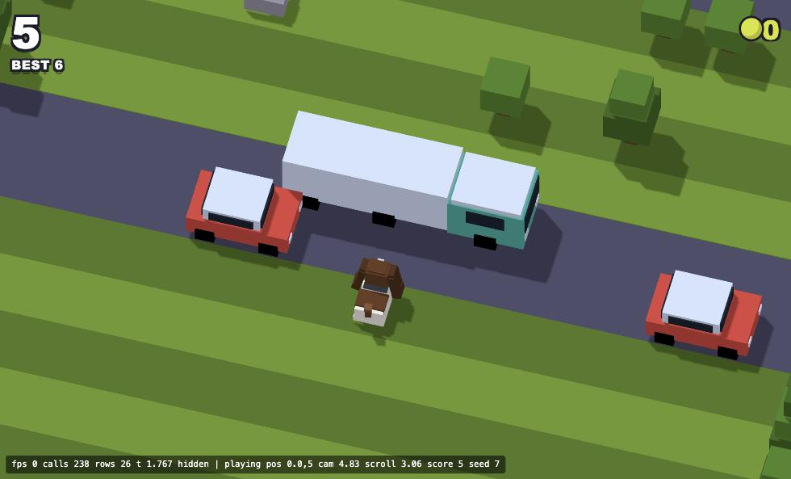<br><b>Block 2</b>: the safety checkpoint. Roads, traffic, a playable game.</td>
    <td align="center">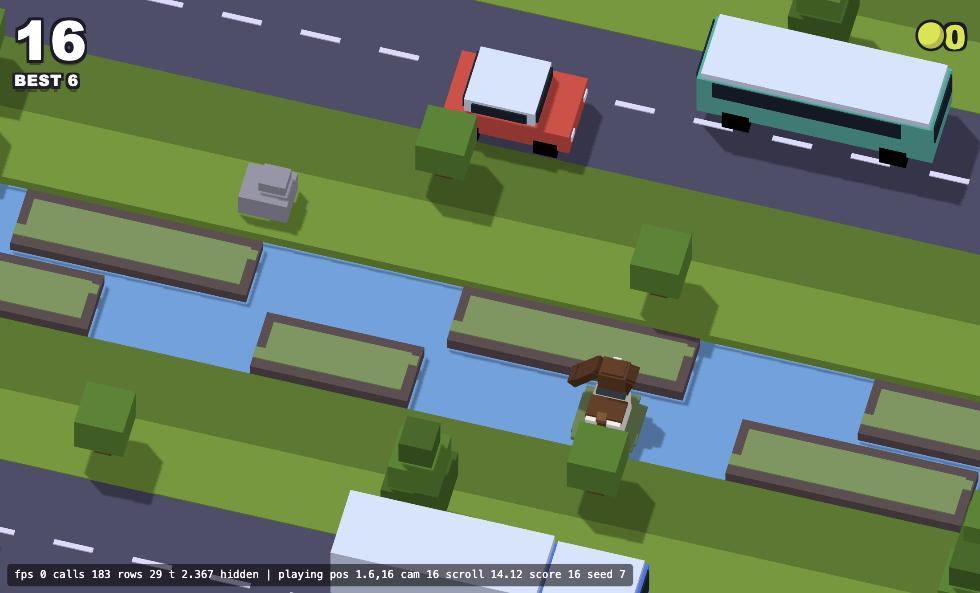<br><b>Block 3</b>: rivers, logs and lily pads.</td>
  </tr>
  <tr>
    <td align="center">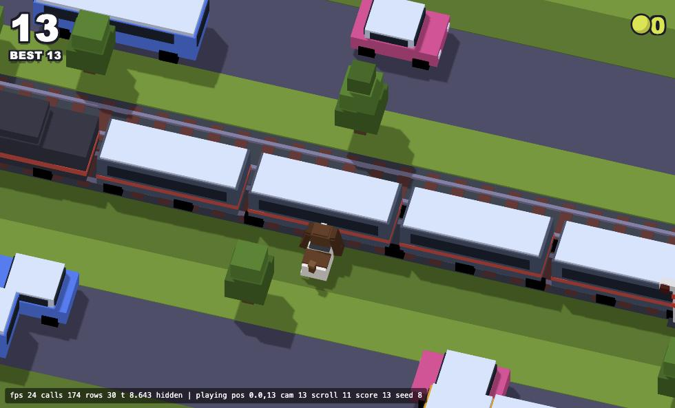<br><b>Block 4</b>: railways and trains.</td>
    <td align="center">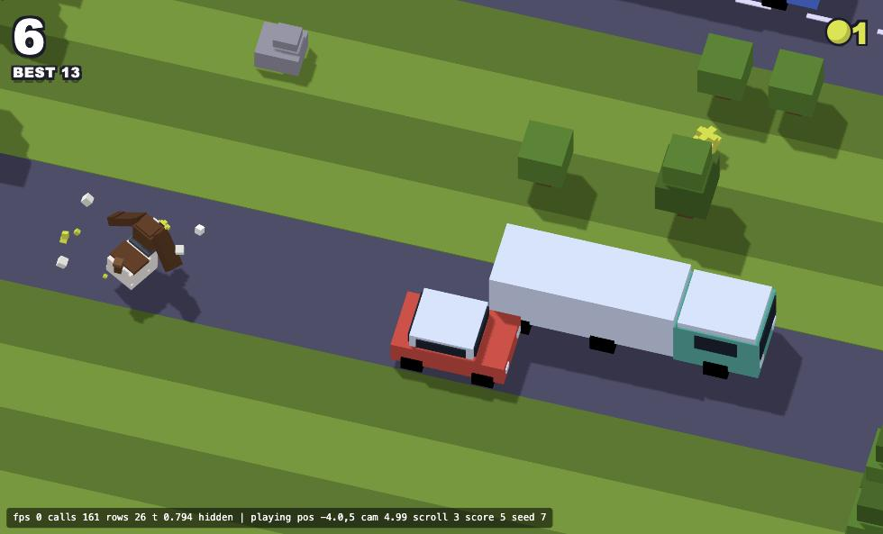<br><b>Block 5</b>: tennis balls and the celebration spin.</td>
    <td align="center">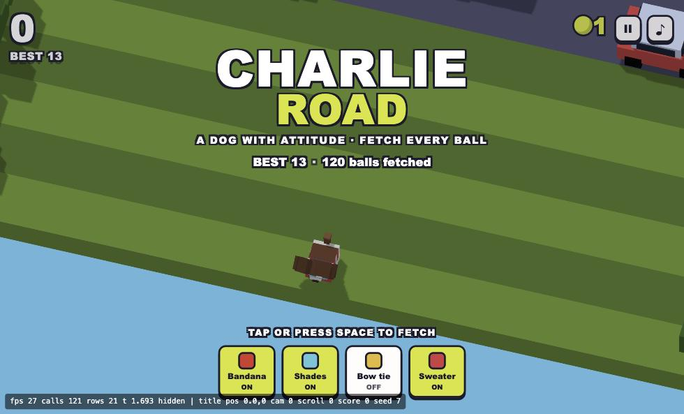<br><b>Block 6</b>: the title screen and the wardrobe.</td>
  </tr>
</table>

### Round two, after playing it

The bark, the squirrels' saucer, the caterpillar, golden balls, combos, zoomies, the day cycle, the daily challenge and the trading card. Built in about 40 minutes.

<table>
  <tr>
    <td align="center">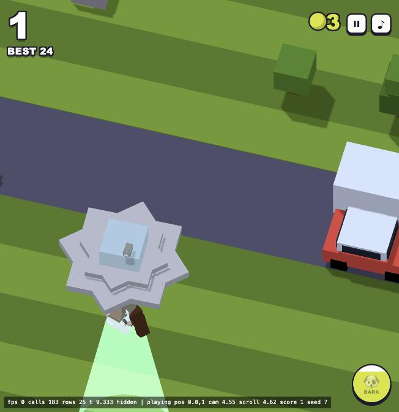<br>The squirrels come for him.</td>
    <td align="center">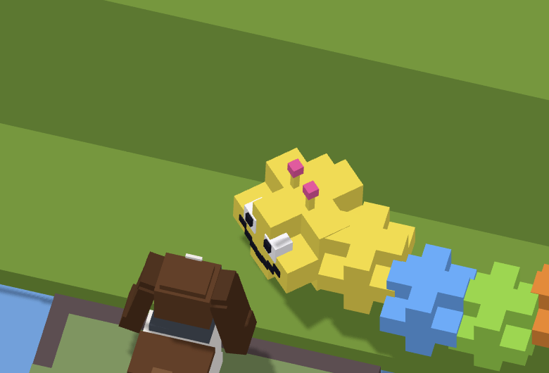<br>The caterpillar, delighted as always.</td>
    <td align="center">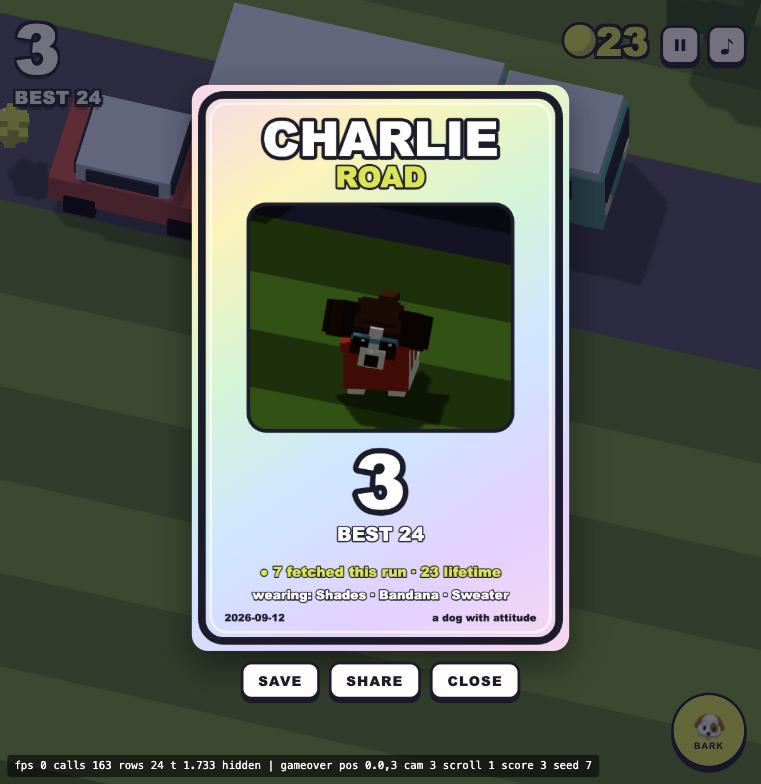<br>The trading card.</td>
  </tr>
</table>

### The final product

Charlie in his sweater, mid-caterpillar, best score 105, 245 balls fetched. Click to watch the gameplay video on YouTube.

<a href="https://youtu.be/4csO6aQQAdw">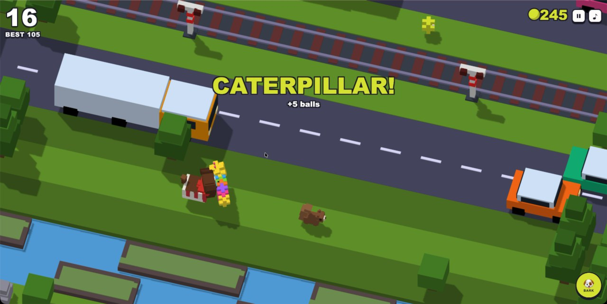</a>

## AI models, tools and strategy

- **In class, v1** (the 30-minute prototype in `v1/`): built with **Kiro**, using its spec workflow (requirements, design, tasks) and then autopilot; Kiro's own log is `kiro_prompt_log.md`.
- **At home, the rebuild and everything since**: built with **Claude Code**. **Claude Opus 5 (1M context)** did the research, plan and spec. **Claude Fable 5.1** did the build, run unattended with Claude Code's **`/goal`** feature until the spec's definition of done held. Verification used the **Claude in Chrome** extension to drive the live game, a `?debug=1` harness on `window.__game` to step the simulation deterministically, a dependency-free `node` test suite, and the GitHub CLI for the repo, pull requests and Pages.

**Strategy in a sentence:** measure the real game first (the camera angle came from lane tilts in App Store screenshots), write a complete spec with machine-checkable acceptance criteria and fairness invariants, then let an autonomous run build it block by block, verifying each block by stepping the simulation through the harness and asserting on state rather than trusting a screenshot, because a backgrounded tab freezes `requestAnimationFrame` and a frozen world looks identical to a running one. Every judgement call the run made is in `DECISIONS.md`; the block-by-block account is in `BUILD_LOG.md`; every prompt is in `prompt_log.md`.

## Known broken or unfinished

- **Shake-to-bark on iPhone** needs the motion permission it asks for on your first tap; it has only been verified with synthetic events, not on a physical device. The 🐶 button always works.
- **Phone layouts** (390x844 portrait, landscape) were verified in a size-constrained container in desktop Chrome, not on real hardware. Touch input was tested with synthetic pointer events.
- **Performance on low-end phones is unmeasured.** Desktop runs at 60 fps; a frame is roughly 150 to 250 draw calls since vehicle lights got their own materials for the night glow.
- **Private-browsing storage** that throws on access is guarded with an in-memory fallback, but that path was never reproduced in a real private window.
- **Outfit thresholds changed** after the first release (shades are now first at 10, bandana 25). A save that had the bandana at 10 balls has it unequipped on load until 25.
- **SHARE on the card** appears only where the browser supports the Web Share API with files (phones, mostly); SAVE always works.
- **The gameplay video** is 442 MB, over GitHub's 100 MB file limit, so it is not in the repo; the link above points to YouTube.
- **Not built** from the suggested features: a ghost replay of your best run, a quests board, and same-device two-player.
- The tests cover the *rules* (world generation, difficulty, collision, timers). Rendering, audio and UI are verified by hand through the harness, not by automated tests.

## Running it locally

Because the game uses ES modules, browsers block it over `file://`, so double-clicking `index.html` gives a blank page. Serve it over HTTP with whatever you have:

```bash
python3 -m http.server 8000     # Python ships with macOS
# or: npx serve
# or: VS Code "Live Server"
# then open http://localhost:8000
```

This is only for previewing. GitHub Pages serves the files over HTTPS from `main` and that is the entire deployment: no build step, no Actions workflow, no configuration beyond `.nojekyll`.

Useful URL parameters:

- `?seed=123` reproduces an exact world
- `?enable_all_outfits=yes` makes every outfit available, for looking at the wardrobe without earning it
- `?debug=1` shows fps, draw calls and row types, and exposes the control surface on `window.__game` (`step`, `steps`, `input`, `reset`, `stats`, `errors`) that drives the simulation independently of `requestAnimationFrame`

## Tests

No dependencies, nothing to install:

```bash
node tests/run.js
```

Checks the world generator's fairness invariants over 50 seeds x 2,000 rows (never an uncrossable road, never an unreachable river, never a walled-off row, never overlapping vehicles) plus the difficulty curve, the idle timer, collision maths and RNG determinism. `package.json` exists only so plain `node` can load ES modules; it declares no dependencies.

## How it's built

- **three.js r186**, vendored into `vendor/` (module + core, both required by that build). No CDN, no npm install, no bundler.
- Orthographic camera at **57° pitch / 15° yaw**, derived by measuring lane angles in real gameplay screenshots and verified by projecting a tile and reading back 12.67° / 0.899, exactly as predicted.
- Every voxel model merged per colour into shared geometries; each grass row's slab, trees and rocks are one mesh per colour; particles are one `InstancedMesh`.
- Vehicle, log and train positions are pure functions of simulated time: no drift, exact replay from a seed. A bark pauses a lane's own clock.
- Game *rules* (world generation, difficulty, collision, timers) are pure functions in `src/rules/`, unit-tested under plain `node`.
- Charlie is rigged: ears on damped springs that fly on the hop, a tail that never stops, a head-tilt-and-glance when kept waiting. Celebrations are a purely visual layer that never blocks input.
- All sound is synthesised in WebAudio; there are no asset files of any kind.

## Documents

| File | What it is |
|---|---|
| [`prompt_log.md`](prompt_log.md) | Every prompt, verbatim, in class and at home, with the models and tools used |
| [`SPEC.md`](SPEC.md) | The build specification: constants, mechanics, models, acceptance criteria, task list; §12 lists the round-two additions |
| [`PLAN.md`](PLAN.md) | The research and reasoning behind it |
| [`DECISIONS.md`](DECISIONS.md) | Every call made during the build where the spec was silent, ambiguous or wrong, with one line of reasoning each |
| [`BUILD_LOG.md`](BUILD_LOG.md) | Block-by-block account of the build sessions |
| [`screenshots/`](screenshots/) | Milestone screenshots from each block and round two; `dev-log/` holds the five in-class versions |
| `development_log.docx` | The in-class development log the V1 to V5 screenshots come from |
| `v1/` | The original 30-minute prototype (canvas 2D), preserved and [playable](https://bcollier.github.io/charlie-road/v1/) |
| `.kiro/specs/`, `kiro_prompt_log.md` | The v1 spec and Kiro's prompt log |
| `reference/` | Gameplay screenshots of the original and photos of Charlie, with a README on what each was used for |

## Credits

Built for **codingWithAI 15113**. *Crossy Road* is by Hipster Whale; this is a study replica, not affiliated with them, and the screenshots in `reference/` are theirs, kept only as visual reference for the rebuild.

Charlie is a real dog. He consented to nothing.
